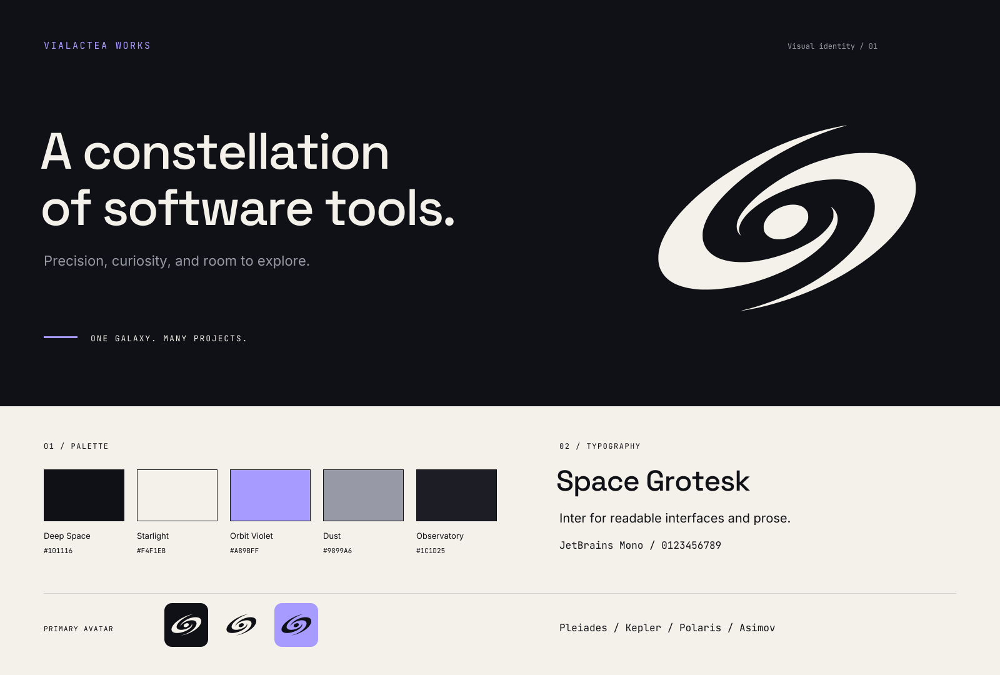

# Vialactea Works — Brand identity

Version 1.0 · October 2026

Vialactea Works is a constellation of tools for building, organizing, and navigating software systems. Its identity pairs a minimalist Milky Way symbol with clear typography, generous space, and a restrained palette.

This directory contains the identity documentation, production logos, GitHub graphics, fonts, and reusable design tokens.

## Start here

- **GitHub organization picture:** upload [github-avatar.png](assets/github-avatar.png), the 512 × 512 primary avatar.
- **Visual guide:** open [guide.html](guide.html) in a browser for examples, actual-size previews, and a printable layout.
- **Scalable logo:** choose a [light symbol](assets/mark-light.svg) for dark backgrounds or a [dark symbol](assets/mark-dark.svg) for light backgrounds.
- **Organization name with symbol:** use the supplied [light lockup](assets/lockup-light.svg) or [dark lockup](assets/lockup-dark.svg).
- **Interface styling:** reuse [tokens.css](tokens.css) and [tokens.json](tokens.json).

## Brand idea and name

The galaxy connects independent projects through a shared center. Each project has its own purpose; the organization gives the collection a recognizable home. The intended character is **precise, curious, and purposeful**.

Use **Vialactea Works** in prose, titles, and organization references. Use `vialactea-works` for the existing GitHub account and technical identifiers. The Portuguese expression *Via Láctea* means *Milky Way* and explains the symbol. Preserve the supplied lowercase lettering in the wordmark artwork.

The organization includes projects at different stages of development and availability. Describe each project's status individually; the organization identity does not imply that every repository is public or open source.

## Logo

### Construction

The symbol consists of two sweeping, tapered spiral arms and a small oval core. Its upward tilt suggests movement, while the open spaces keep the silhouette legible. The production artwork uses three smooth, closed vector shapes and one foreground color.

The horizontal lockup combines the symbol with the `vialactea` wordmark and a smaller `WORKS` label. Use the supplied artwork to preserve its spacing and proportions. Its lettering is outlined, so displaying the SVG does not require installed fonts.

### Approved versions

| Version | Foreground | Background | Use |
| --- | --- | --- | --- |
| Primary | Starlight | Deep Space | Organization avatar, dark graphics, headers |
| Light | Deep Space | Starlight or white | Light layouts and documents |
| Violet symbol | Orbit Violet | Deep Space | Secondary emphasis on dark layouts |
| Violet avatar | Deep Space | Orbit Violet | Alternate organization avatar |
| Black | Pure black | White or a light substrate | One-color reproduction |

**File naming:** `mark-light` and `lockup-light` describe the light **foreground**. Avatar suffixes describe the **background**: `github-avatar-light` has a dark symbol on a light background, and `github-avatar-violet` has a dark symbol on violet. The primary dark-background avatar has no suffix.

### Spacing and size

- Let **W** equal the width of the visible symbol. Leave at least **W / 8** clear on every side.
- Keep the visible symbol at least **32px wide** in layouts you control.
- Use an avatar container at least **48 × 48px** when you control its size. The supplied symbol occupies approximately 68% of the square's width.
- Keep the full square when uploading the avatar; its built-in padding accommodates square and circular crops.
- Use the symbol alone at compact sizes. Do not put the organization name inside the avatar.

The [size-check sheet](assets/size-checks.png) shows square and circular crops at 24, 32, 48, 64, 96, and 160px. The 24px and 32px avatar examples are stress tests: the shape remains recognizable, but its fine tips lose detail. Platforms may display smaller avatars automatically.

### Preserve the artwork

Keep the supplied tilt, proportions, core, and arm shapes. Use the entire mark in one color. Avoid stretching, rotating, outlining, applying gradients or shadows, adding stars or orbital rings, or recoloring the arms separately. Use a quiet, high-contrast background.

## Color

| Color | HEX | RGB | Role |
| --- | --- | --- | --- |
| Deep Space | `#101116` | 16, 17, 22 | Primary dark background; text on light |
| Starlight | `#F4F1EB` | 244, 241, 235 | Primary light foreground; light background |
| Orbit Violet | `#A89BFF` | 168, 155, 255 | Accent, links on dark, selected details |
| Dust | `#9899A6` | 152, 153, 166 | Secondary text on dark backgrounds |
| Observatory | `#1C1D25` | 28, 29, 37 | Raised surfaces in dark layouts |

Keep approximately 90% of a composition neutral. Use violet for a specific point of emphasis. The primary logo remains Starlight on Deep Space.

### Readability

| Foreground / background | Contrast |
| --- | --- |
| Starlight / Deep Space | 16.73:1 |
| Orbit Violet / Deep Space | 7.90:1 |
| Dust / Deep Space | 6.68:1 |
| Orbit Violet / Starlight | 2.12:1 |
| Dust / Starlight | 2.50:1 |

Use Deep Space for text on Starlight. Violet and Dust do not provide enough contrast for ordinary text on that light background. Underline text links and use labels or shapes alongside color to communicate state. Observatory and Deep Space are close in value; add a visible border when a boundary must be clear.

The interface tokens also include white surfaces and `#565865` for secondary text on light backgrounds. These are supporting interface values, not additional signature brand colors.

## Typography

| Family | Weight | Role | Typical setting |
| --- | --- | --- | --- |
| Space Grotesk | Medium 500 | Wordmark, headings, project names | 48 / 32 / 24px; tight heading line height |
| Inter | Regular 400, Medium 500 | Body copy, navigation, interfaces | 16px with 1.6 line height; supporting text 14px / 1.5 |
| JetBrains Mono | Regular 400 | Code, versions, short metadata | 12px / 1.4 for labels |

Use sentence case for headings. Start with `-0.025em` tracking for large headings and normal tracking for small headings. Uppercase metadata may use `0.08em` tracking. Keep paragraphs around 60–70 characters per line and use Inter for extended prose.

The [fonts directory](fonts/) includes variable TTF files for desktop design tools, WOFF2 files for web use, and a separate OFL license for each family. Preserve the relevant license when redistributing a font. Those licenses cover the fonts; they do not establish a license for the logo artwork.

Font sources: [Space Grotesk](https://github.com/floriankarsten/space-grotesk), [Inter](https://github.com/rsms/inter), and [JetBrains Mono](https://www.jetbrains.com/lp/mono/).

GitHub controls the typography of ordinary README text. Use the supplied graphics for branded lettering and keep descriptive repository text selectable.

## Layout and graphic language

- Use a 4px spacing rhythm, commonly 8, 16, 24, 32, 48, and 64px. Give important content generous margins.
- Align prose and project descriptions to the left. Let one headline or visual lead each composition.
- Use solid color fields, thin rules, and short labels. Repeat the galaxy sparingly.
- Keep interfaces restrained; the supplied CSS uses an 8px corner-radius token.
- Avoid decorative star fields, glows, and unrelated code fragments around the identity. Use real product screenshots or diagrams when they explain the work.

For project graphics, use the project name as the main heading and **Vialactea Works** as a smaller organization signature. Keep typography, palette, and layout consistent across the family.

| Project | Description |
| --- | --- |
| Pleiades | A knowledge and content system for connected information. |
| Kepler | A disciplined workflow for designing and building software. |
| Polaris | A workspace navigator for understanding and maintaining repositories. |
| Asimov | Declarative configuration for AI-agent ecosystems. |

Use direct sentences and concrete capabilities. Explain what a tool does, who it helps, and its current status. Prefer specific behavior to claims such as “revolutionary” or “next-generation.”

## GitHub applications

### Organization avatar

Upload [github-avatar.png](assets/github-avatar.png) as the organization picture. This file is an opaque, square 512 × 512 PNG with the primary dark background. A [1024px master](assets/github-avatar-1024.png) is included for larger uses. Keep the entire square in the crop.

### Organization profile header

Use [github-header.svg](assets/github-header.svg), a 1280 × 400 image, at the top of the organization profile README. A [PNG version](assets/github-header.png) is also available.

The repository's [profile README](../profile/README.md) already references the SVG. If editing that file, the relative image path is `../brand/assets/github-header.svg`. Keep meaningful alternative text, such as “Vialactea Works — A constellation of software tools.”

### Social preview

Use [social-card.png](assets/social-card.png), 1280 × 640, when a general organization graphic is appropriate. For a project-specific version, retain the visual system and replace the main copy with that project's name and purpose. The editable vector is [social-card.svg](assets/social-card.svg).

## Asset directory

All paths below are relative to this `brand` directory.

| Asset | Files | Format and dimensions |
| --- | --- | --- |
| Primary avatar | [PNG](assets/github-avatar.png), [SVG](assets/github-avatar.svg), [large PNG](assets/github-avatar-1024.png) | 512px square; 1024px PNG master |
| Light avatar | [PNG](assets/github-avatar-light.png), [SVG](assets/github-avatar-light.svg), [large PNG](assets/github-avatar-light-1024.png) | 512px square; 1024px PNG master |
| Violet avatar | [PNG](assets/github-avatar-violet.png), [SVG](assets/github-avatar-violet.svg), [large PNG](assets/github-avatar-violet-1024.png) | 512px square; 1024px PNG master |
| Light symbol | [SVG](assets/mark-light.svg), [PNG](assets/mark-light.png) | Transparent; PNG 1024px square |
| Dark symbol | [SVG](assets/mark-dark.svg), [PNG](assets/mark-dark.png) | Transparent; PNG 1024px square |
| Violet symbol | [SVG](assets/mark-violet.svg), [PNG](assets/mark-violet.png) | Transparent; PNG 1024px square |
| Black symbol | [SVG](assets/mark-black.svg), [PNG](assets/mark-black.png) | Transparent; PNG 1024px square |
| Light horizontal logo | [SVG](assets/lockup-light.svg), [PNG](assets/lockup-light.png) | Transparent; PNG 510 × 148 |
| Dark horizontal logo | [SVG](assets/lockup-dark.svg), [PNG](assets/lockup-dark.png) | Transparent; PNG 510 × 148 |
| Profile header | [SVG](assets/github-header.svg), [PNG](assets/github-header.png) | 1280 × 400 |
| Social card | [SVG](assets/social-card.svg), [PNG](assets/social-card.png) | 1280 × 640 |
| Identity overview | [SVG](assets/identity-board.svg), [PNG](assets/identity-board.png) | 1600 × 1080 |
| Avatar size checks | [SVG](assets/size-checks.svg), [PNG](assets/size-checks.png) | 1000 × 520 |

Use SVG for scaling and design work. Use PNG for direct uploads and applications that do not accept SVG. Rendered assets do not require a build step to use.

## Maintaining the identity

| File or directory | Purpose |
| --- | --- |
| [README.md](README.md) | Repository-readable identity documentation |
| [guide.html](guide.html) | Visual and printable guide with local fonts |
| [assets/](assets/) | Production SVG and PNG artwork |
| [fonts/](fonts/) | Font files and their license notices |
| [tokens.css](tokens.css) | Font declarations, colors, spacing, and theme variables |
| [tokens.json](tokens.json) | Portable identity values |
| [source/galaxy-master.svg](source/galaxy-master.svg) | Authoritative vector silhouette, traced directly from the approved original |
| [source/build.py](source/build.py) | Shared master placement, palette, outlined lettering, and export process |
| [source/design-brief.json](source/design-brief.json) | Design rationale, references, and generation prompts |
| [source/concept.png](source/concept.png) | Approved original raster reference; use production assets for publishing |

The concept was explored with the built-in imagegen tool. The production silhouette is traced directly from that approved image, preserving the thickness and taper of both arms. Every logo, avatar, and branded graphic uses the same master vector. The [Vorssaint reference](https://github.com/vorssaint/vorssaint-utils) informed the bold silhouette and sweeping curves; its artwork is not included or reused.

To rebuild the exports, use Python 3.11 or later with `fonttools[woff]` and `rsvg-convert` available, then run `python brand/source/build.py` from the repository root. The script overwrites the generated assets, WOFF2 font copies, and `tokens.json`. Geometry lives in `source/galaxy-master.svg`; palette and composition definitions live in `source/build.py`. Keep the master on its original 1254 × 1254 canvas with three closed paths. Rebuilding requires no raster tracing or image generation. Keep `tokens.css`, this document, and the visual guide synchronized with intentional identity changes.

Before distributing an updated kit, inspect the avatar at small sizes and in a circular crop, check that lettering stays inside its canvas, verify transparency and color values, and confirm that guide links and font files still resolve.
